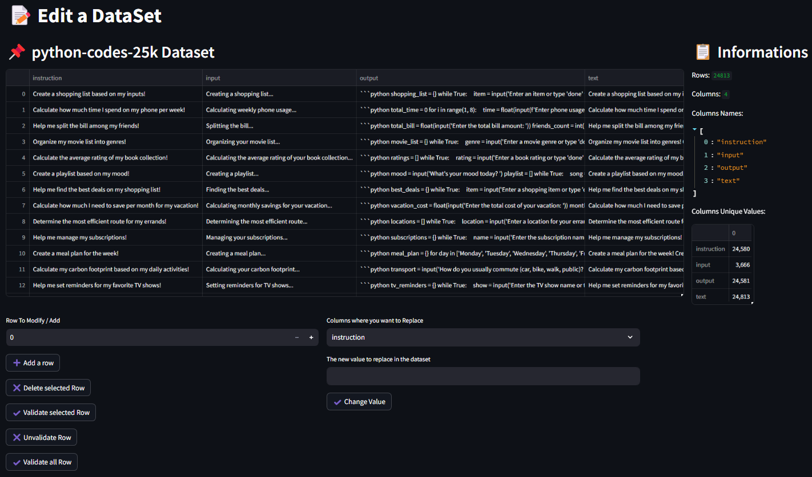
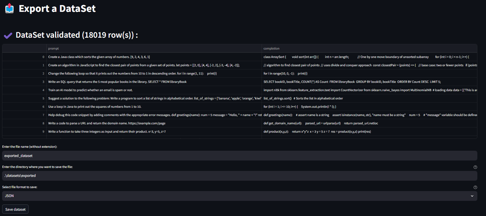

# DataSet Factory

## ▶ Introduction

DataSet_Factory is a Python application tool who can read, edit, verify, export a dataset and other... 

## ▶ How to install

### ⚠ Dependencies

Make sure you have one of latests versions of Python. Install all necessary packages with this command : `pip install streamlit pandas numpy`

### 🔰 Usage

Run the app with `streamlit run .\src\Home.py`

## 1️⃣ Import Dataframe

This page only serves to import an load a JSON, JSONL *(and PARQUET soon !)* dataframes inside 20GB. 

## 2️⃣ Edit Dataframe

This is on this page were edit, verify or simply see your dataframe imported is possible. You have some informations about the dataframe on the right like the number of rows, columns, columns names...

## 3️⃣ Export Dataframe

In this page, you can export the dataframe you imported. You can choose his name, his directory and change his origin extension too.  

